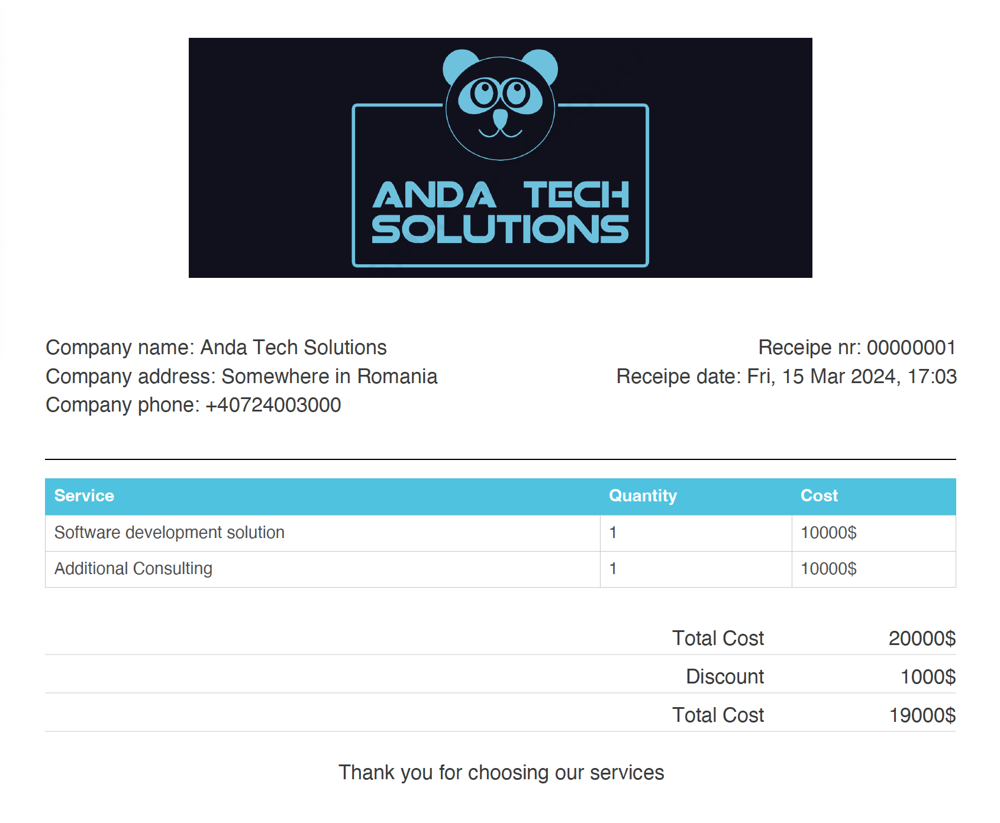

# dynamic-jspdf-receipt - Pdf receipt generator with [jsPDF](https://www.npmjs.com/package/jspdf) and [jsPDF-AutoTable](https://www.npmjs.com/package/jspdf-autotable)

**Generate PDF tables with Javascript**

Using jsPDF and jsPDF-AutoTable, this library is both browser and node compatible. It is used on a doc created by jsPDF, a library to generate PDFs in JavaScript.



## Installation

Get jsPDF, jsPDF-AutoTable and this plugin by doing one of these things:

- `npm install jspdf jspdf-autotable dynamic-jspdf-receipt`

## Usage

# React

```js
import JsPDF from 'jspdf'
import { generatePdfReceipt } from 'dynamic-jspdf-receipt'

const doc = new JsPDF({
  compress: true,
});

generatePdfReceipt(doc, {
  logo: {
    source: images[language],
    extension: 'PNG',
    ratioWidthPerHeigh: ratioWidthPerHeigh[language],
  },
  companyDetails: [
    {
      name: 'Company name',
      value: 'Anda Tech Solutions',
    },
    {
      name: 'Company address',
      value: 'Bucharest, Romania',
    },
    {
      name: 'Company phone',
      value: '(+XX)XXX-XXX-XXX',
    },
  ],
  receiptDetails: [
    {
      name: 'Receipe nr.',
      value: '00000001',
    },
    {
      name: 'Receipe date',
      value: dayjs(new Date()).format('ddd, DD MMM YYYY, HH:MM'),
    },
  ],
  purchaseTable: {
    headers: ['Service', 'Quantity', 'Cost'],
    items: [
      ['Software development solution', '1', '100000$'],
      ['Additional Consulting', '1', '100000$'],
    ],
    headerColor: [0, 95, 173],
  },
  additionalInfo: ['Thank you for choosing our services'],
  ammountDetails: [
    {
      name: 'Total Cost',
      value: '20000$',
    },
    {
      name: 'Discount',
      value: '1000$',
    },
    {
      name: 'Total Cost',
      value: '19000$',
    },
  ],
});

doc.save('table.pdf')
```

# Node
```js
const { jsPDF } = require("jspdf");
const { generatePdfReceipt } = require('dynamic-jspdf-receipt');

const doc = new jsPDF({
  compress: true,
});

generatePdfReceipt(doc, {
  logo: {
    source: images[language],
    extension: 'PNG',
    ratioWidthPerHeigh: ratioWidthPerHeigh[language],
  },
  companyDetails: [
    {
      name: 'Company name',
      value: 'Anda Tech Solutions',
    },
    {
      name: 'Company address',
      value: 'Bucharest, Romania',
    },
    {
      name: 'Company phone',
      value: '(+XX)XXX-XXX-XXX',
    },
  ],
  receiptDetails: [
    {
      name: 'Receipe nr.',
      value: '00000001',
    },
    {
      name: 'Receipe date',
      value: dayjs(new Date()).format('ddd, DD MMM YYYY, HH:MM'),
    },
  ],
  purchaseTable: {
    headers: ['Service', 'Quantity', 'Cost'],
    items: [
      ['Software development solution', '1', '100000$'],
      ['Additional Consulting', '1', '100000$'],
    ],
    headerColor: [0, 95, 173],
  },
  additionalInfo: ['Thank you for choosing our services'],
  ammountDetails: [
    {
      name: 'Total Cost',
      value: '20000$',
    },
    {
      name: 'Discount',
      value: '1000$',
    },
    {
      name: 'Total Cost',
      value: '19000$',
    },
  ],
});

doc.save('table.pdf')
```